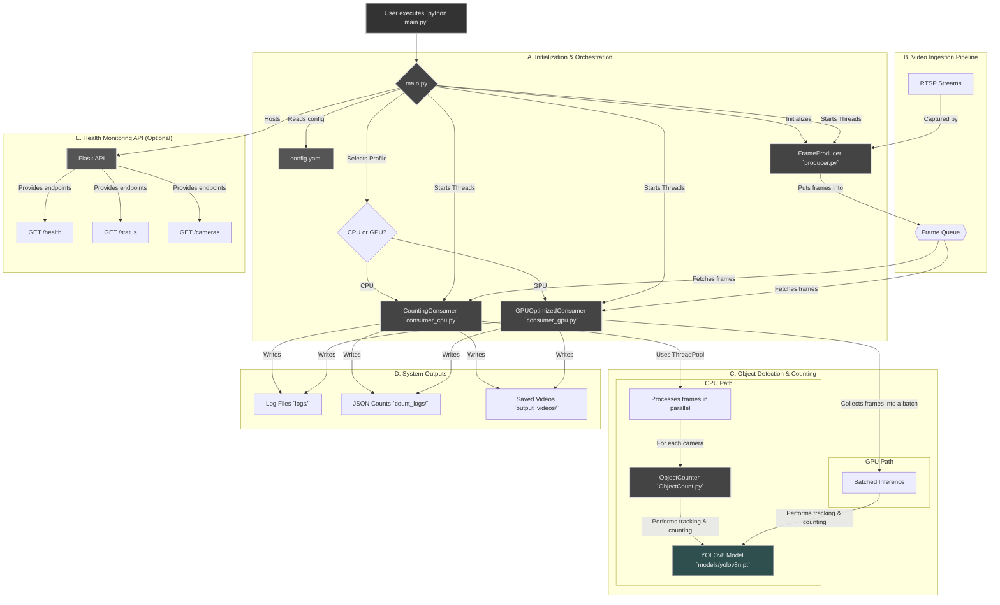

# MCVA (Multi-Camera Video Analysis) System

## Overview

This document provides a detailed technical overview of the Multi-Camera Video Analysis (MCVA) system, version 3.3. The system is designed for real-time object detection, tracking, and counting from multiple RTSP video streams. It is built to be configurable, scalable, and efficient, with support for both CPU and GPU processing.

The core functionality revolves around a producer-consumer architecture:
- **Producer**: Connects to multiple camera streams, captures frames at a target FPS, and places them into a shared queue.
- **Consumer**: Retrieves frames from the queue, performs object detection and tracking using a YOLOv8 model, and counts objects that cross predefined lines.
- **Main Orchestrator**: Initializes and manages the producer and consumer, handles configuration, logging, and provides a health monitoring API.

## System Architecture

The system is composed of several key Python scripts and a central configuration file that work together to perform video analysis.

1.  **`config.yaml`**: The central configuration file for the entire system. It defines camera sources, model parameters, counting rules, and hardware-specific profiles (CPU/GPU).
2.  **`main.py`**: The main entry point of the application. It reads the configuration, selects the appropriate hardware profile, initializes the producer and consumer, and starts the processing pipeline. It also hosts an optional Flask-based API for health monitoring.
3.  **`producer.py`**: Responsible for connecting to the RTSP streams defined in `config.yaml`. It runs a separate thread for each camera, capturing frames, resizing them to the model's input size, and putting them into a shared frame queue for the consumer to process. It includes robust reconnection logic with exponential backoff.
4.  **`consumer_cpu.py` / `consumer_gpu.py`**: These are the workhorses of the system. They fetch frames from the producer's queue and process them.
    *   `consumer_gpu.py`: Optimized for systems with a CUDA-enabled GPU. It performs true batched inference, sending a batch of frames from multiple cameras to the GPU in a single call for maximum efficiency.
    *   `consumer_cpu.py`: Optimized for CPU-only systems. It uses a thread pool to process frames from different cameras in parallel, maximizing CPU core utilization.
5.  **`ObjectCount.py`**: A utility class used by the `consumer_cpu.py` script. It encapsulates the logic for object counting, including tracking object history and determining when an object crosses a predefined line. The `consumer_gpu.py` integrates this logic directly for better performance.

## Flow Diagram

The following diagram illustrates the data flow through the system:



## File Descriptions

### `main.py`
This is the orchestrator of the system.
- **Responsibilities**:
    - Parses command-line arguments (`--profile`, `--visualize`, `--save`).
    - Loads and merges configuration from `config.yaml` based on the selected profile (CPU/GPU).
    - Sets up file and console logging.
    - Selects and initializes the appropriate consumer (`consumer_cpu.py` or `consumer_gpu.py`).
    - Initializes the `FrameProducer`.
    - Starts the producer and consumer in separate threads.
    - Manages the main application loop, handling graceful shutdown (Ctrl+C).
    - Triggers periodic and final count logging.
    - Optionally starts a `HealthAPI` (Flask-based) for remote monitoring.

### `producer.py`
Handles all aspects of video frame acquisition.
- **Class**: `FrameProducer`
- **Responsibilities**:
    - Reads camera configurations from the main config.
    - For each camera, it starts a dedicated thread (`_capture_frames`).
    - Each thread attempts to connect to its RTSP stream with a robust reconnection strategy (exponential backoff).
    - Captures frames, respecting the `target_fps` setting.
    - Pre-processes each frame by resizing it to the model's input dimension (`model_input_size`).
    - Puts the processed frame and its metadata (camera ID, original frame, etc.) into a thread-safe queue (`frame_queue`).
    - Provides methods to check the queue size and camera connection status.

### `consumer_cpu.py`
The CPU-optimized processing unit.
- **Class**: `CountingConsumer`
- **Responsibilities**:
    - Fetches frame data from the producer's queue.
    - Groups incoming frames by `camera_id`.
    - Uses a `ThreadPoolExecutor` to process frames from different cameras in parallel.
    - For each camera, it uses an `ObjectCounter` instance to perform tracking and counting.
    - Manages the state for each camera's counter (e.g., in/out counts, tracked IDs).
    - Optionally visualizes the output (real-time display or saving to video).
    - Gathers count data for periodic and final logging.

### `consumer_gpu.py`
The GPU-optimized processing unit.
- **Class**: `GPUOptimizedConsumer`
- **Responsibilities**:
    - Collects frames from the producer's queue until a batch is full (`batch_size`) or a timeout is reached (`batch_timeout`).
    - Performs **true batched inference**: sends the entire batch of frames to the YOLOv8 model in a single `model.track()` call. This is highly efficient on GPUs.
    - Processes the batched results, associating detections back to their original camera.
    - Implements the counting logic directly within the class to avoid the overhead of the separate `ObjectCounter` class.
    - Manages all tracking and counting state internally.
    - Like the CPU consumer, it handles optional visualization and gathers data for logging.

### `ObjectCount.py`
A helper class for the CPU consumer that encapsulates counting logic.
- **Class**: `ObjectCounter`
- **Responsibilities**:
    - Inherits from Ultralytics' `BaseSolution`.
    - Initializes a counting region (line or polygon).
    - Processes tracking results from the YOLO model.
    - Maintains a history of tracked objects (`track_history`).
    - Determines if an object's trajectory intersects with the counting region.
    - Increments "IN" or "OUT" counts based on the direction of crossing.
    - Stores counts on a per-class basis (e.g., 'person', 'car').

### `config.yaml`
The central configuration hub.
- **Sections**:
    - `cameras`: Defines each camera's RTSP URL, a friendly name, the counting line coordinates, and which object classes to count.
    - `common`: Shared settings like `frame_queue_size` and `target_fps`.
    - `model`: Specifies the model file (`yolov8n.pt`), confidence threshold, and input size.
    - `counting`: Controls logging frequency (`log_interval`) and visualization options.
    - `visualization`: Defines colors, thicknesses, and fonts for drawing on frames.
    - `video_save`: Codec and FPS for saved videos.
    - `paths`: Defines output directories for models, logs, and videos.
    - `producer`: Fine-tunes the camera reconnection logic.
    - `health_api`: Enables and configures the Flask monitoring API.
    - `profiles`: Contains `cpu` and `gpu` specific settings (e.g., `batch_size`, `device`) that override the base settings.

## API Endpoints

When `health_api.enabled` is `true` in `config.yaml`, the system exposes a REST API for monitoring.

### `GET /health`
A simple endpoint to check if the service is running.
- **Success Response (200 OK)**:
  ```json
  {
    "status": "healthy",
    "uptime_seconds": 1035.26
  }
  ```

### `GET /cameras`
Provides detailed configuration and live status for all configured cameras.
- **Success Response (200 OK)**:
  ```json
  {
    "camera_1": {
      "classes_to_count": ["person"],
      "counting_line_coordinates": [[240, 0], [240, 480]],
      "counting_line_enabled": true,
      "name": "Camera 1",
      "rtsp_url": "rtsp://localhost:18554/mystream",
      "status": {
        "connected": true,
        "thread_alive": true
      }
    },
    "camera_2": {
      "classes_to_count": ["person", "car"],
      "counting_line_coordinates": [[240, 0], [240, 480]],
      "counting_line_enabled": true,
      "name": "Camera 2",
      "rtsp_url": "rtsp://localhost:18554/mystream",
      "status": {
        "connected": true,
        "thread_alive": true
      }
    }
  }
  ```

### `GET /status`
Gives a comprehensive snapshot of the entire system's state, including uptime, queue size, and detailed counting status for each camera.
- **Success Response (200 OK)**:
  ```json
  {
    "system": "running",
    "uptime_seconds": 1030.76,
    "queue_size": 0,
    "cameras": {
      "camera_1": { ... },
      "camera_2": { ... }
    },
    "counting_status": {
      "timestamp": "2025-11-14T12:10:43.171734",
      "cameras": {
        "camera_1": {
          "name": "Camera 1",
          "unique_tracks": 46,
          "time_since_last_log": 130.34,
          "next_log_in": 769.65,
          "classwise_counts": {
            "person": { "IN": 46, "OUT": 0 }
          }
        },
        "camera_2": { ... }
      }
    }
  }
  ```

## Log Formats

The system generates two types of JSON logs in the directory specified by `paths.count_log_dir`.

### Periodic Counts Log
This log is generated at the interval defined by `counting.log_interval` in the config.
- **Filename**: `periodic_counts_YYYYMMDD_HHMMSS.json`
- **Structure**:
  ```json
  {
    "timestamp": "2025-11-14 12:08:33",
    "camera_camera_1": {
      "camera_name": "Camera 1",
      "elapsed_seconds": 900.28,
      "in_count": 40,
      "out_count": 0,
      "classwise_counts": {
        "person": { "IN": 40, "OUT": 0 }
      },
      "log_type": "PERIODIC"
    },
    "camera_camera_2": { ... }
  }
  ```

### Final Counts Log
This log is generated once when the application is gracefully shut down. It contains the cumulative counts since the last periodic log.
- **Filename**: `final_counts_YYYYMMDD_HHMMSS.json`
- **Structure**:
  ```json
  {
    "timestamp": "2025-11-14 12:11:08",
    "camera_camera_1": {
      "camera_name": "Camera 1",
      "elapsed_seconds": 155.21,
      "in_count": 47,
      "out_count": 0,
      "classwise_counts": {
        "person": { "IN": 47, "OUT": 0 }
      },
      "log_type": "FINAL"
    },
    "camera_camera_2": { ... }
  }
  ```

## How to Run

### Prerequisites
1.  **Python**: Ensure you have Python 3.8+ installed.
2.  **Dependencies**: Install the required Python packages. A `requirements.txt` file is available in the `misc/` directory.
    ```bash
    pip install -r misc/requirements.txt
    ```
3.  **PyTorch**: Install the appropriate version of PyTorch for your hardware (CPU or GPU). Follow the instructions on the [official PyTorch website](https://pytorch.org/get-started/locally/).
4.  **YOLOv8 Model**: Download the `yolov8n.pt` model file and place it in the `V3.3/models/` directory.

### Configuration
1.  Open `V3.3/config.yaml`.
2.  **Cameras**: Under the `cameras` section, configure each of your RTSP streams.
    - `rtsp_url`: The full URL of the stream.
    - `name`: A user-friendly name for the camera.
    - `counting_line`: Set `enabled: true` and define the `coordinates` of the line or polygon for counting. A line is two points `[[x1, y1], [x2, y2]]`, while a polygon is three or more.
    - `classes_to_count`: A list of object classes you want to count (e.g., `["person", "car"]`). Leave it empty `[]` or as `null` to count all classes detected by the model.
3.  **Profiles**: The `profiles` section contains pre-configured settings for `cpu` and `gpu`. The script will automatically select the best profile, but you can force one using the `--profile` flag.
4.  **Other Settings**: Adjust other parameters like `target_fps`, `confidence_threshold`, and `log_interval` as needed.

### Running the Application

Execute `main.py` from within the `V3.3/` directory.

- **Automatic Profile Selection**:
  The system will automatically detect if a CUDA-enabled GPU is available and use the `gpu` profile. Otherwise, it will fall back to the `cpu` profile.
  ```bash
  python main.py
  ```

- **Force a Specific Profile**:
  Use the `--profile` argument to force CPU or GPU mode.
  ```bash
  # Force CPU mode
  python main.py --profile cpu

  # Force GPU mode
  python main.py --profile gpu
  ```

- **Enable Visualization**:
  - To display the output in real-time OpenCV windows, use the `--visualize` flag.
    ```bash
    python main.py --profile gpu --visualize
    ```
  - To save the annotated video streams to files in the `output_videos` directory, use the `--save` flag.
    ```bash
    python main.py --profile gpu --save
    ```

- **To Stop**:
  Press `Ctrl+C` in the terminal. The application will perform a graceful shutdown, stopping all threads and writing a final count log.
